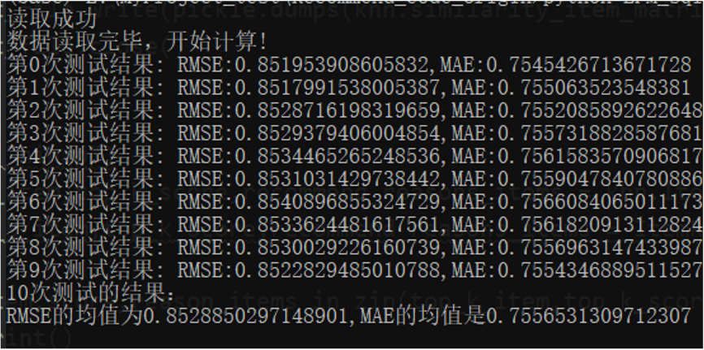
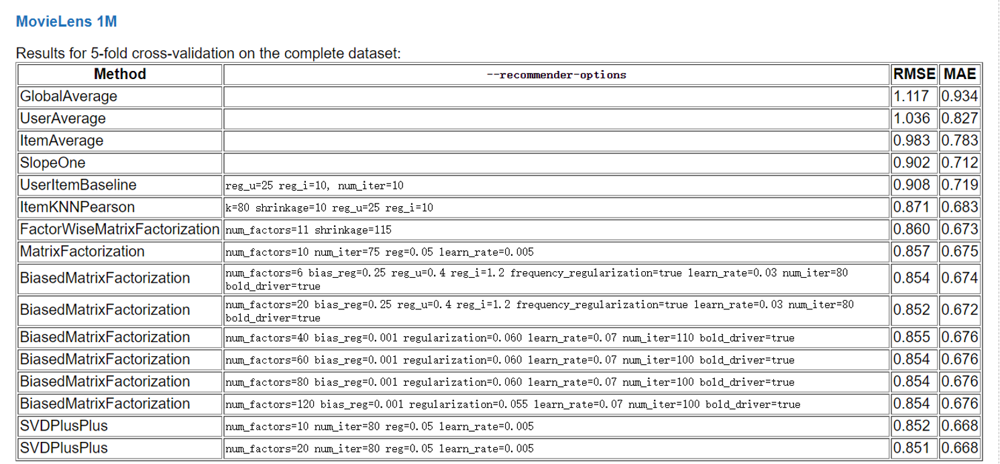
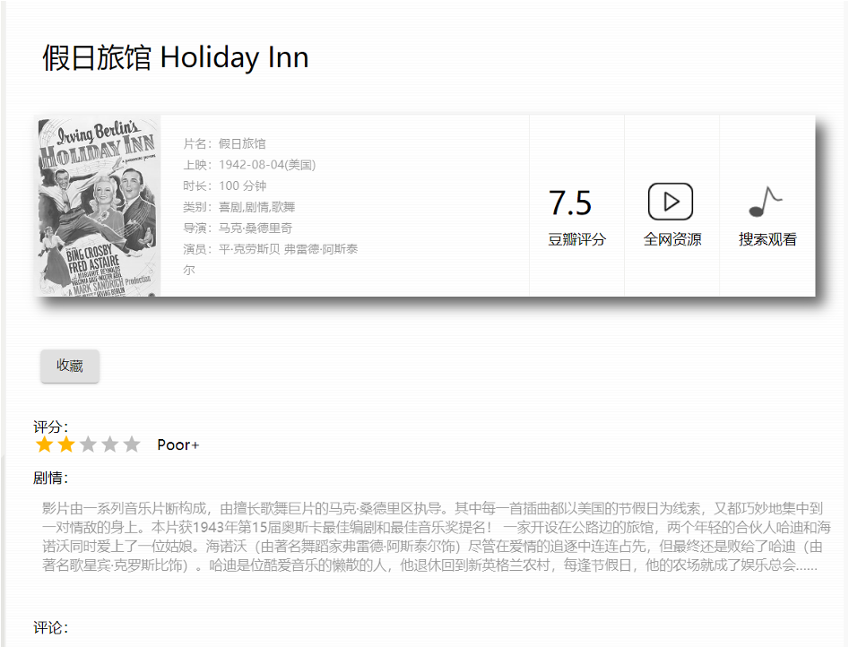
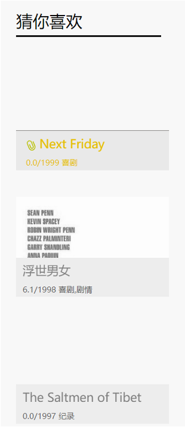
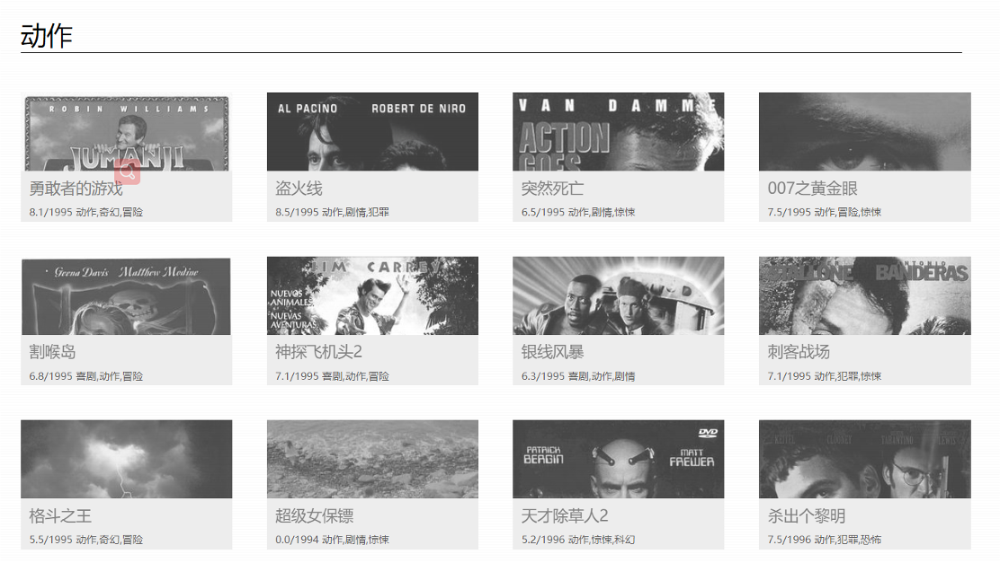
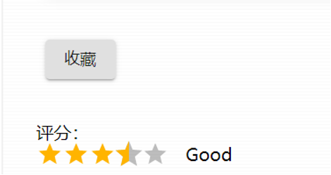

# MovieRecommendWeb

#### 项目说明

本项目是学校的一个市级创新项目-大学生电影推荐系统。本人是项目组组长，主要负责推荐算法，另外两个，一个负责后端和数据库，一个负责前端。最终可以运行。

部署使用了腾讯云服务器，和腾讯云Mysql数据库进行了部署，不过现在已经过期了。

#### 算法说明

实现了两个算法，一个是基于物品的协同过滤算法。具体代码见Recommend/KNN41.py。(KNN_test.py是用来提前加载模型的，用于部署)

一个是LFM（隐语义算法）。具体代码见Recommend、LFM_sql.py。(LFM_test.py是用来提前加载模型的，用于部署)

最后的推荐结果是结合了两个算法。

核心的推荐代码如下：（Users/views.py）

```python
def getRecommendMovies(request, userID):
    user_id = request.session.get('user', None)
    if (user_id):
        print('id:' + str(user_id))
    predict_num = 4
    RecommendMovies = lfm.RecommendtoUser(userID, 4, sparse_matrix)
    top_k_item, top_k_score, recommend_reasons_items = knn.ItemRecommend(
        origin_data, userID, 4, predict_num)
    # print(RecommendMovies)
    FinalRecommend = list(top_k_item) + RecommendMovies
    print(RecommendMovies)
    print(top_k_item)
    print(top_k_score)
    return HttpResponse(FinalRecommend)
```

Recommend_code_origin存储的测试代码，自动忽略。其他文件夹均基本是Django数据库，前端代码不知道在哪里。

**算法结果**


**Baseline结果**



#### 技术说明

前端采用React，后端采用Pthon的Django框架，数据库采用Mysql。机器学习部分使用sklearn。

#### 数据集说明

使用的是MovieLens数据集，包含4000多个用户，6000多部电影，100万左右个评分数据。
数据集下载地址：
链接：https://pan.baidu.com/s/18VDK-cjRFj_dy7mqJksZtA 
提取码：nlp1 

#### 使用说明

本地部署的话，直接运行Django框架即可，也就是运行manage.py，然后在本地端口进行访问。
下面是**效果展示**：

#### 效果展示

**用户登录后，主页显示相应的推荐结果（根据用户ID进行针对性推荐）**：


**电影详情页**：


**相似电影**：


**猜你喜欢**：


**电影分类**：


**电影评分功能**：


[](https://star-history.com/#Xie-Minghui/MovieRecommendWeb&Date)
